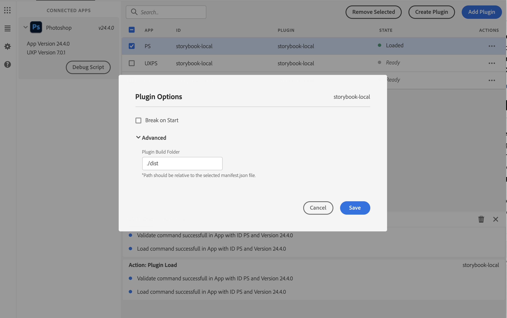
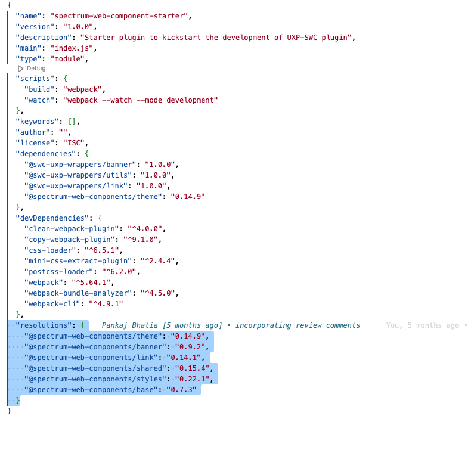

# Studio Companion Redux (UXP Plugin)

**Version:** 2.0.0

Studio Companion Redux is a UXP plugin for Adobe Photoshop (v24.4.0+) designed to streamline the design and creation workflow for **Velocity Ads**. It provides a user-friendly panel within Photoshop called "Velocity: Editor" with a guided **Build Assistant** and a powerful set of **Editor Tools**.

## Key Features

*   **Velocity Ad Workflow:** Specifically tailored to help designers efficiently build all components of Velocity Ads, including desktop and mobile versions.
*   **Build Assistant:** A step-by-step guided process for creating:
    *   Desktop & Mobile Rest States (Expanded & Collapsed)
    *   Desktop & Mobile Velocity States (scroll-reactive designs)
    *   Desktop & Mobile Intro Animation Sequences
*   **Automated Processes:** Includes actions like converting layers to Smart Objects, propagating designs across artboards, and preparing assets for animation.
*   **Powerful Editor Tools:**
    *   **Layer Management:** Select, link, unlink, and delete layers by name.
    *   **Asset Propagation:** Duplicate and fill missing assets across multiple artboards or states.
    *   **Smart Object Conversion:** Easily convert layers to Smart Objects.
    *   **Targeted Edits:** Scope edits to specific devices (Desktop/Mobile) and ad states (Intro, Expanded, Collapsed).
*   **Spectrum Web Components UI:** Built with modern Adobe Spectrum Web Components for a native look and feel.
*   **UXP Powered:** Leverages the UXP API for deep integration with Photoshop.

## Prerequisites

1.  [NodeJS](https://nodejs.org/en) (>= v14.20.0)
2.  [Yarn package manager](https://yarnpkg.com/getting-started/install)
3.  Adobe UXP Developer Tool (UDT)
4.  Adobe Photoshop (v24.4.0 or newer)

## Getting Started

### Build and Run the Plugin

1.  **Install Dependencies:** Open your terminal in the project root directory and run:
    ```bash
    yarn install
    ```
2.  **Build the Plugin:**
    ```bash
    yarn build
    ```
    This will create a `dist` folder containing the bundled plugin.
3.  **(Optional) Watch for Changes:** For development, you can use:
    ```bash
    yarn watch
    ```
    This will automatically rebuild the plugin when you save changes to source files.

### Load the Plugin in Photoshop

1.  Ensure Photoshop is running.
2.  Open the UXP Developer Tool (UDT). You should see Photoshop under 'Connected apps'.
3.  Click the 'Add Plugin' button and select the [manifest.json](cci:7://file:///c:/development/studio-companion-redux/manifest.json:0:0-0:0) file from your project's root directory.
4.  The plugin will appear in the list. Click the `•••` actions menu next to it.
5.  Select 'Load'. The "Velocity: Editor" panel should now be available in Photoshop (usually under the Plugins menu).
6.  **(Optional) Watch for Live Reload:** In the UDT, select 'Watch' from the plugin's `•••` menu. This will automatically reload the plugin in Photoshop when `yarn watch` rebuilds it. (Note: Manifest changes require a manual unload and reload).


*(You may want to update this screenshot and add others showing the actual "Velocity: Editor" panel interface)*

## Plugin Interface Overview

The "Velocity: Editor" panel is organized into three main sections, accessible via the side navigation:

1.  **Build Assistant:** (Default view) Guides you through the creation of Velocity Ad components.
2.  **Editor:** Provides a suite of tools for fine-grained control over layers and assets within your ad designs.
3.  **Production:** (Details TBD - this section will likely contain tools for finalizing and exporting your ads).

### Build Assistant

The Build Assistant walks you through a series of steps to construct your Velocity Ads:

1.  **Design Desktop Rest States:** Create the initial expanded and collapsed desktop ad designs.
    *   *Next Action:* Converts layers to Smart Objects and propagates them to new "Velocity State" artboards.
2.  **Design Desktop Velocity States:** Design the scroll-reactive versions for desktop.
    *   *Next Action:* Reveals and focuses on artboards for mobile rest state creation.
3.  **Design Mobile Rest States:** Create the initial expanded and collapsed mobile ad designs.
    *   *Next Action:* Converts layers to Smart Objects and propagates them for mobile Velocity States.
4.  **Design Mobile Velocity States:** Design the scroll-reactive versions for mobile.
    *   *Next Action:* Sets up the artboards for the desktop intro animation sequence.
5.  **Design Desktop Intro Sequence:** Build the frame-by-frame intro animation for desktop. You can add multiple frames.
    *   *Next Action:* Sets up the artboards for the mobile intro animation sequence.
6.  **Design Mobile Intro Sequence:** Build the frame-by-frame intro animation for mobile.
    *   *Next Action:* Finalizes the project (e.g., fixes Smart Objects, sanitizes layers).

Each step provides clear directions. Use the "Previous" and "Next" buttons to navigate. Some steps include a "+" button for adding iterative elements like intro frames.

### Editor Tools

The Editor section provides more granular control:

*   **Editor Scope:**
    *   **Devices:** Filter actions to target only Desktop (`:dt`) or Mobile (`:mb`) artboards.
    *   **States:** Filter actions to target Intro, Expanded, or Collapsed states.
*   **Layer Selection Shortcuts:**
    *   `Select Layers by Name`: Prompts for a layer name (or pattern) to select matching layers.
    *   `Link Layer by Name`: Prompts for a layer name to link matching layers.
    *   `Unlink Layer by Name`: Prompts for a layer name to unlink matching layers.
*   **Asset Actions:**
    *   `Propagate Asset(s)`: Duplicates selected layer(s) to other relevant artboards based on scope.
    *   `Fill Missing Asset(s)`: Attempts to find and place missing linked assets.
    *   `Purge Asset(s)`: Deletes selected layer(s) based on name and scope.
    *   `Replace With Smart Object`: Converts selected raster/text layers to Smart Objects.
*   **Artboard Actions (TBD):** Future tools for managing artboards directly.

## Adding New Spectrum Web Components

This project uses `swc-uxp-wrappers` to integrate Spectrum Web Components (SWC) for UXP.

1.  **Install the component wrapper and the specific SWC version:**
    ```bash
    yarn add @swc-uxp-wrappers/component-name@version @spectrum-web-components/component-name@version
    ```
    Example:
    ```bash
    yarn add @swc-uxp-wrappers/link@2.0.0 @spectrum-web-components/link@0.36.0
    ```
    **Important:** Check the `swc-uxp-wrappers` documentation or existing [package.json](cci:7://file:///c:/development/studio-companion-redux/package.json:0:0-0:0) for compatible versions. Add the specific `@spectrum-web-components/component-name` version to the `resolutions` block in [package.json](cci:7://file:///c:/development/studio-companion-redux/package.json:0:0-0:0) to avoid version conflicts.

    

2.  **Import the component in [src/index.js](cci:7://file:///c:/development/studio-companion-redux/src/index.js:0:0-0:0):**
    ```javascript
    // For wrapped components
    import '@swc-uxp-wrappers/link/sp-link.js';

    // For non-wrapped (direct SWC) components like theme, icons
    import '@spectrum-web-components/theme/sp-theme.js';
    ```
    The project's `webpack.config.js` uses aliasing for `swc-uxp-wrappers`.

3.  **Use the component in your HTML ([src/index.html](cci:7://file:///c:/development/studio-companion-redux/src/index.html:0:0-0:0) or other HTML partials):**
    ```html
    <sp-link href="#">Example Link</sp-link>
    ```
4.  Rebuild the plugin (`yarn build` or let `yarn watch` do it).

## Troubleshooting

If you see errors like `Failed to execute 'define' on 'CustomElementRegistry': the name "sp-icon-alert" has already been used with this registry`:

*   Ensure [index.js](cci:7://file:///c:/development/studio-companion-redux/src/index.js:0:0-0:0) is not somehow being loaded or executed multiple times.
*   Verify the component and its dependencies are correctly listed in the `resolutions` block in [package.json](cci:7://file:///c:/development/studio-companion-redux/package.json:0:0-0:0).
*   Ensure you are using the exact recommended versions for SWC components (without `^` or `~` in `resolutions` unless intended).

## License

ISC