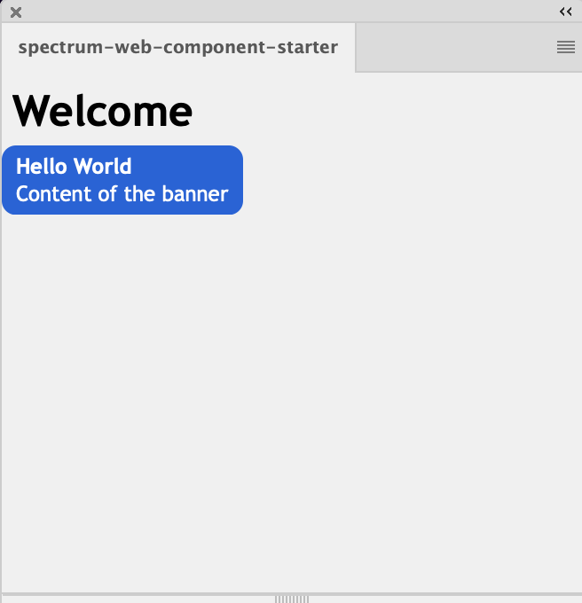

# Studio Companion Redux (Velocity: Editor UXP Plugin)

**Version:** 2.0.0

Studio Companion Redux is a UXP plugin for Adobe Photoshop (v24.4.0+) designed to streamline the design and creation workflow for **Velocity Ads**. It provides a user-friendly panel within Photoshop called "Velocity: Editor" with a guided **Build Assistant** and a powerful set of **Editor Tools**.

## Key Features

*   **Velocity Ad Workflow:** Specifically tailored to help designers efficiently build all components of Velocity Ads, including desktop and mobile versions.
*   **Build Assistant:** A step-by-step guided process for creating:
    *   Desktop & Mobile Rest States (Expanded & Collapsed)
    *   Desktop & Mobile Velocity States (scroll-reactive designs)
    *   Desktop & Mobile Intro Animation Sequences
*   **Automated Processes:** Includes actions like converting layers to Smart Objects, propagating designs across artboards, and preparing assets for animation.
*   **Powerful Editor Tools:**
    *   **Layer Management:** Select, link, unlink, and delete layers by name.
    *   **Asset Propagation:** Duplicate and fill missing assets across multiple artboards or states.
    *   **Smart Object Conversion:** Easily convert layers to Smart Objects.
    *   **Targeted Edits:** Scope edits to specific devices (Desktop/Mobile) and ad states (Intro, Expanded, Collapsed).
*   **Spectrum Web Components UI:** Built with modern Adobe Spectrum Web Components for a native look and feel.
*   **UXP Powered:** Leverages the UXP API for deep integration with Photoshop.

## Prerequisites

1.  [NodeJS](https://nodejs.org/en) (>= v14.20.0)
2.  [Yarn package manager](https://yarnpkg.com/getting-started/install)
3.  Adobe UXP Developer Tool (UDT)
4.  Adobe Photoshop (v24.4.0 or newer)

## Getting Started

### Build and Run the Plugin

1.  **Install Dependencies:** Open your terminal in the project root directory and run:
    ```bash
    yarn install
    ```
2.  **Build the Plugin:**
    ```bash
    yarn build
    ```
    This will create a `dist` folder containing the bundled plugin.
3.  **(Optional) Watch for Changes:** For development, you can use:
    ```bash
    yarn watch
    ```
    This will automatically rebuild the plugin when you save changes to source files.

### Load the Plugin in Photoshop

1.  Ensure Photoshop is running.
2.  Open the UXP Developer Tool (UDT). You should see Photoshop under 'Connected apps'.
3.  Click the 'Add Plugin' button and select the [manifest.json](cci:7://file:///c:/development/studio-companion-redux/manifest.json:0:0-0:0) file from your project's root directory.
4.  The plugin will appear in the list. Click the `•••` actions menu next to it.
5.  Select 'Load'. The "Velocity: Editor" panel should now be available in Photoshop (usually under the Plugins menu).
6.  **(Optional) Watch for Live Reload:** In the UDT, select 'Watch' from the plugin's `•••` menu. This will automatically reload the plugin in Photoshop when `yarn watch` rebuilds it. (Note: Manifest changes require a manual unload and reload).


*(You may want to update this screenshot and add others showing the actual "Velocity: Editor" panel interface)*

## Plugin Interface Overview

The "Velocity: Editor" panel is organized into three main sections, accessible via the side navigation:

1.  **Build Assistant:** (Default view) Guides you through the creation of Velocity Ad components.
2.  **Editor:** Provides a suite of tools for fine-grained control over layers and assets within your ad designs.
3.  **Production:** (Details TBD - this section will likely contain tools for finalizing and exporting your ads).

### Build Assistant

The Build Assistant walks you through a series of steps to construct your Velocity Ads:

1.  **Design Desktop Rest States:** Create the initial expanded and collapsed desktop ad designs.
    *   *Next Action:* Converts layers to Smart Objects and propagates them to new "Velocity State" artboards.
2.  **Design Desktop Velocity States:** Design the scroll-reactive versions for desktop.
    *   *Next Action:* Reveals and focuses on artboards for mobile rest state creation.
3.  **Design Mobile Rest States:** Create the initial expanded and collapsed mobile ad designs.
    *   *Next Action:* Converts layers to Smart Objects and propagates them for mobile Velocity States.
4.  **Design Mobile Velocity States:** Design the scroll-reactive versions for mobile.
    *   *Next Action:* Sets up the artboards for the desktop intro animation sequence.
5.  **Design Desktop Intro Sequence:** Build the frame-by-frame intro animation for desktop. You can add multiple frames.
    *   *Next Action:* Sets up the artboards for the mobile intro animation sequence.
6.  **Design Mobile Intro Sequence:** Build the frame-by-frame intro animation for mobile.
    *   *Next Action:* Finalizes the project (e.g., fixes Smart Objects, sanitizes layers).

Each step provides clear directions. Use the "Previous" and "Next" buttons to navigate. Some steps include a "+" button for adding iterative elements like intro frames.

### Editor Tools

The Editor section provides more granular control:

*   **Editor Scope:**
    *   **Devices:** Filter actions to target only Desktop (`:dt`) or Mobile (`:mb`) artboards.
    *   **States:** Filter actions to target Intro, Expanded, or Collapsed states.
*   **Layer Selection Shortcuts:**
    *   `Select Layers by Name`: Prompts for a layer name (or pattern) to select matching layers.
    *   `Link Layer by Name`: Prompts for a layer name to link matching layers.
    *   `Unlink Layer by Name`: Prompts for a layer name to unlink matching layers.
*   **Asset Actions:**
    *   `Propagate Asset(s)`: Duplicates selected layer(s) to other relevant artboards based on scope.
    *   `Fill Missing Asset(s)`: Attempts to find and place missing linked assets.
    *   `Purge Asset(s)`: Deletes selected layer(s) based on name and scope.
    *   `Replace With Smart Object`: Converts selected raster/text layers to Smart Objects.
*   **Artboard Actions (TBD):** Future tools for managing artboards directly.

## Adding New Spectrum Web Components

This project uses `swc-uxp-wrappers` to integrate Spectrum Web Components (SWC) for UXP.

1.  **Install the component wrapper and the specific SWC version:**
    ```bash
    yarn add @swc-uxp-wrappers/component-name@version @spectrum-web-components/component-name@version
    ```
    Example:
    ```bash
    yarn add @swc-uxp-wrappers/link@2.0.0 @spectrum-web-components/link@0.36.0
    ```
    **Important:** Check the `swc-uxp-wrappers` documentation or existing [package.json](cci:7://file:///c:/development/studio-companion-redux/package.json:0:0-0:0) for compatible versions. Add the specific `@spectrum-web-components/component-name` version to the `resolutions` block in [package.json](cci:7://file:///c:/development/studio-companion-redux/package.json:0:0-0:0) to avoid version conflicts.

    

2.  **Import the component in [src/index.js](cci:7://file:///c:/development/studio-companion-redux/src/index.js:0:0-0:0):**
    ```javascript
    // For wrapped components
    import '@swc-uxp-wrappers/link/sp-link.js';

    // For non-wrapped (direct SWC) components like theme, icons
    import '@spectrum-web-components/theme/sp-theme.js';
    ```
    The project's `webpack.config.js` uses aliasing for `swc-uxp-wrappers`.

3.  **Use the component in your HTML ([src/index.html](cci:7://file:///c:/development/studio-companion-redux/src/index.html:0:0-0:0) or other HTML partials):**
    ```html
    <sp-link href="#">Example Link</sp-link>
    ```
4.  Rebuild the plugin (`yarn build` or let `yarn watch` do it).

## Troubleshooting

If you see errors like `Failed to execute 'define' on 'CustomElementRegistry': the name "sp-icon-alert" has already been used with this registry`:

*   Ensure [index.js](cci:7://file:///c:/development/studio-companion-redux/src/index.js:0:0-0:0) is not somehow being loaded or executed multiple times.
*   Verify the component and its dependencies are correctly listed in the `resolutions` block in [package.json](cci:7://file:///c:/development/studio-companion-redux/package.json:0:0-0:0).
*   Ensure you are using the exact recommended versions for SWC components (without `^` or `~` in `resolutions` unless intended).

## License

ISC


# LEGACY: UXP Plugin with Spectrum Web Component

These are legacy docs for the starter UXP plugin:

## Documentation
- [SWC in UXP](https://developer.adobe.com/photoshop/uxp/2022/uxp-api/reference-spectrum/swc)
- [Adobe's list of SWC](https://opensource.adobe.com/spectrum-web-components/index.html)


## Getting started

**Pre-requisites**
1. [NodeJS](https://nodejs.org/en) (>= v 14.20.0)
2. [Yarn package manager](https://yarnpkg.com/getting-started/install)
3. UXP Developer Tool (UDT)

**Build and run**
1. Start by installing the dependencies `yarn install`.
2. Prepare the bundle using Webpack `yarn build`. You will notice a **dist** folder after this step.
3. (Optional) `yarn watch` to automatically build the project every time you update a source file and `yarn start` to keep the plugin running and automatically build after every change.

**Load the plugin into the application via UDT**
1. Make sure the application is running and you can see it under 'Connected apps'.
2. Click on 'Add Plugin' button and select the `manifest.json` of this plugin.
3. Configure the `dist` folder of your plugin by using 'More' -> 'Advanced' option from the action menu `•••`
4. Click on the ••• menu on the corresponding plugin row. Select 'Load' to view the plugin inside your application.
5. (Optional) Select 'Watch' from plugin actions ••• to dynamically load the latest plugin changes. Note that a manifest change would need you to 'Unload' and 'Load' the plugin from scratch.


You should be able to see a banner in Photoshop plugin.




## Add a new component
You can use any of the supported components listed in [our docs](https://developer.adobe.com/photoshop/uxp/2022/uxp-api/reference-spectrum/swc) by following these steps:
1. Use `yarn add` to install the components and its supported version.

```javascript
yarn add @swc-uxp-wrappers/link@1.0.0;
```

**Note:** The UXP-SWC components are delivered via wrappers over specific SWC versions. For example, `@swc-uxp-wrappers/banner` is locked and wrapped on  **0.9.2** version of ```@spectrum-web-components/banner```. Make sure to install the latest `swc-uxp-wrappers` and add the recommended SWC component version (example 0.9.2) in resolutions block too. Also, components like `icons`, `icons-workflow`, `icons-ui`, `theme`, `shared`, `base`, `styles` do not use wrappers and therefore must be directly consumed from npm.


2. Import the component in `index.js` file. This has two approaches:

   a. Import directy via `@swc-uxp-wrappers`
   ```javascript
   import "@swc-uxp-wrappers/link/sp-link.js";
   ```
   b. Import via `@spectrum-web-components` and use aliasing in the webpack.conf.js file.
   ```javascript
   import '@spectrum-web-components/link/sp-link.js';
   ```
   We are using aliasing to map these components (`@swc-uxp-wrappers` to `@spectrum-web-components` in webpack.conf.js as described in Deep Dive section). This approach makes the plugin cross-platform compatible i.e we can remove the aliasing and use the same plugin on Web.

3. Add the component in the html file.

   ```html
   This is an <sp-link href="#">example link</sp-link>.
   ```

4. Run `yarn build` to prepare the distribution bundle.
You can also use `yarn watch` to create the bundle as soon as you save your changes to any source files. Use this along with Plugin -> Watch option in UDT to sync with latest changes automatically.

## Deep dive
Now that the plugin is working, we can look into the details.

### webpack.config.js
Webpack is used to bundle the dependencies in the project therefore you would see the webpack.config.js file for basic config.

Note that we have installed the `@swc-uxp-wrappers/utils` package in the package.json file and are using it to provide [aliasing](https://webpack.js.org/configuration/resolve/#resolvealias) via mapping. We can remove this aliasing and use the same plugin on web too.

```
       resolve: {
            extensions: ['.js', '.json'],
            alias: aliases,

        }
```

Pro tip: For debugging purposes, add `eval-cheap-source-map` in the webpack.config file to get the source map in UDT debug window.

```javascript
devtool: 'eval-cheap-source-map'
```

### package.json
Once you install the component (using `yarn add`) you should see the components added to the 'dependencies'.

Also, in order to resolve transitive dependencies we need to [force resolutions](https://classic.yarnpkg.com/lang/en/docs/selective-version-resolutions/). Thereby to avoid incompatibility issues in sub components, one needs to mention all the dependencies in the `resolutions` block too.

### manifest.json
Enable SWC by setting the **enableSWCSupport flag** to true.

```
"featureFlags": {
   "enableSWCSupport": true
}
```

### src/index.html
Includes index.js.

Observe that the SWC components are wrapped with a ```<sp-theme>``` element. This ensures that the Spectrum design tokens are delivered to the scoped HTML context.


### src/index.js
Import the components and themes to deliver the right styling to the components.
```javascript
//sp-theme
import '@spectrum-web-components/theme/sp-theme.js';
//themes to use classic and spectrum themes
import '@spectrum-web-components/theme/src/themes.js';
import '@spectrum-web-components/theme/src/express/themes.js';
```


## Troubleshooting

 If you see the following error in the console, these are some steps to resolve it.

```
Failed to execute 'define' on 'CustomElementRegistry': the name "sp-icon-alert" has already been used with this registry
```

Such errors occur when the package manager has resolved more than one copy of the component (sp-icon-alert in this case). Some of the ways to troubleshoot are:

* Make sure you dont have multiple calls to `index.js` somehow.
* Check if you have added the component in the resolutions block in package.json.
* Check if you are using correct recommended version of the package without the `^`.

